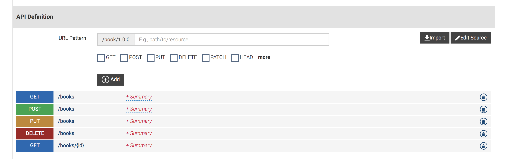

# BOOK STORE

This is Book Store application which is used to display the books that are in the book store. This is a demo application where the backend is built using the
Spring Boot and Front end is implemented in React.

Backend Endpoints are exposed through WSO2 API Manager. <a href="https://docs.wso2.com/display/AM260/Key+Concepts">WSO2 API Manager</a> is used to secure the endpoints and throttle out the request. Implicit grant type is used to obtain access tokens
from the frontend application to access the APIs.

Please refer this <a href="https://docs.wso2.com/display/AM260/Implicit+Grant">documentation</a> to get an understanding of how Implicit grant type is working in WSO2 API Manager. Spring boot rest endpoints
are exposed through the API Manager. Refer this <a href="swagger.json">swagger</a> file to create an API in WSO2 API Manager.

After getting this project create an API using the WSO2 API Manager and then start the backend application and use this(npm start) command to start the Frontend React Application.

# GET
	http://localhost:8081/rest/books

# GET By ID
	http://localhost:8081/rest/books/100

# POST
	http://localhost:8081/rest/books

# PUT
	http://localhost:8081/rest/books

# DELETE
	http://localhost:8081/rest/books/100

# Requests

	{
	    "title": "Spring in Action",
	    "author": "Craig Walls",
	    "coverPhotoURL": "https://images-na.ssl-images-amazon.com/images/I/51gHy16h5TL.jpg",
	    "isbnNumber": 9789351197997,
	    "price": 630,
	    "language": "English"
	}
	{
	    "title": "Java Persistence with Hibernate",
	    "author": "Christian Bauer and Gavin King",
	    "coverPhotoURL": "https://images.manning.com/720/960/resize/book/d/2ea186d-c683-4d54-95f9-cca25b6fe49e/bauer2.png",
	    "isbnNumber": 9351199193,
	    "price": 771,
	    "language": "English"
	}
	{
	    "title": "Grails in Action",
	    "author": "Glen Smith and Peter Ledbrook",
	    "coverPhotoURL": "https://images.manning.com/720/960/resize/book/6/3e9d5ed-4155-466d-ab46-538bb355948d/gsmith2.png",
	    "isbnNumber": 1617290963,
	    "price": 2907,
	    "language": "English"
	}
	{
	    "title": "Spring Boot in Action",
	    "author": "Craig Walls",
	    "coverPhotoURL": "https://images.manning.com/720/960/resize/book/6/bb80688-f898-4df7-838a-253b1de123c4/Walls-SpringBoot-HI.png",
	    "isbnNumber": 1617292540,
	    "price": 3149,
	    "language": "English"
	}
	{
	    "title": "Head First Java: A Brain-Friendly Guide",
	    "author": "Kathy Sierra",
	    "coverPhotoURL": "https://covers.oreillystatic.com/images/9780596004651/lrg.jpg",
	    "isbnNumber": 8173666024,
	    "price": 498,
	    "language": "English"
	}

# Please Contribute to this Application by implementing below extra features.
* Move the database from H2 to MySQL or any other production database.
* Have a separate view for updating the book information and deleting the book.
* Implement an Authorization Code grant type to access the Book APIs.
